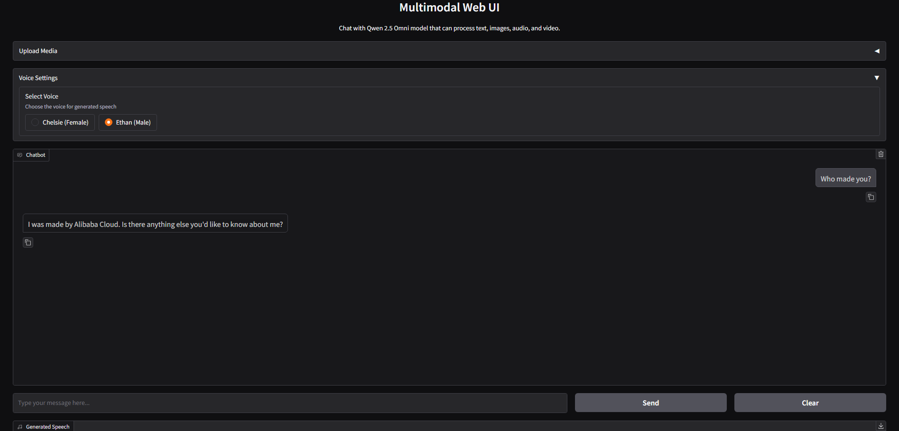

# Multimodal Web UI

A simple web user interface for capable of processing text, speech, and image.



## Installation

1. Clone this repository

```bash
git https://github.com/vpakarinen/multimodal-webui.git

cd multimodal-webui
```

2. Create and activate virtual environment:

```bash
python -m venv multimodal-env

# Windows
.\multimodal-env\Scripts\activate

# Linux/macOS
source multimodal-env/bin/activate
```

3. Install the required packages:

```bash
pip install -r requirements.txt
```

4. Install transformers:

```bash
pip install git+https://github.com/huggingface/transformers@f742a644ca32e65758c3adb36225aef1731bd2a8
```

5. Run the application:

```bash
python app.py
```

## How to Use Flash Attention
- ``pip install flash-attn``
- set USE_FLASH_ATTENTION to true from app.py

## Required Files

The application will automatically download the following files if they don't exist:
- **Qwen 2.5 Omni 7B model files** (~14GB): The model weights and configuration files.
- **Additional model components**: Tokenizers, processors, and other dependencies.
- **qwen-omni-utils package**: Official utilities for processing multi-modal inputs.

## Notes
- Latest development version of ``transformers`` is required to run this model
- Audio and video input support will be coming in future updates

## Sponsor

If you find this project useful, consider supporting me:

[](https://www.buymeacoffee.com/vpakarinen)

[](https://ko-fi.com/vpakarinen)

## Credits

This project uses the [Qwen2.5-Omni](https://github.com/QwenLM/Qwen2.5-Omni) library for multimodal functionality.

## Author

vpakarinen (https://github.com/vpakarinen)
